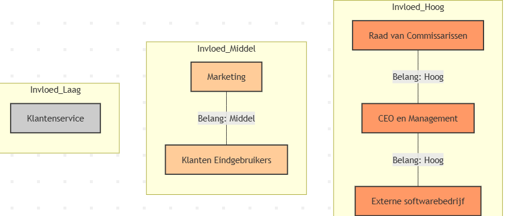

# _Requirements-specificatie_
***Solmate***

Welkom bij de requirements specificatie van SolMate, ons innovatieve telefoonbedrijf is gespecialiseerd in het ontwikkelen van mobiele telefoons met geintegreerde zonnepaneeltechnologie.
SolMate speelt in op de hedendaagdse behoefte aan duurzaamheid, zelfredzaamheid en onafhankelijkheid van het stroomnet. In deze bestanden wordt beschreven hoe en waarom maatwerksystemen passend zijn voor SolMate.
Het document dient als leidraad voor zowel de stakeholders als het developmentteam en zorgt voor het omzetten van de behoeften van de organisatie naar concrete modellen en user stories.

## Organisatorische Context

### _Missie_
Om als bedrijf onder Phoneventures een app te ontwikkelen waar klanten toegang hebben tot diensten en informatie voor en over de aangekochte telefoon. Wij willen duurzame technologie voor iedereen toegankelijk maken, waarbij onze producten betrouwbaar zijn en minimale milieu impact hebben. Bij SolMate combineren we innovatie en milieuvriendelijkheid, zodat klanten technologie kunnen kiezen die hen ondersteunt en de planeet respecteert.

### _Visie_
Het verbeteren van klantrelaties en klantervaring die op termijn leidt tot hogere omzet, lagere kosten voor customerservice en een concurentievoordeel door innovatieve en klantgerichte oplossingen te bieden. Wij streven ernaar om technologie te ontwikkelen die niet alleen vernieuwend is, maar ook duurzaam en verantwoord. SolMate wil de markt leiden met producten die zowel functioneel als milieuvriendelijk zijn, en die klanten de mogelijkheid bieden om technologie te gebruiken die hen ondersteunt en tegelijkertijd de planeet respecteert. Door constant te investeren in onze eigen innovaties, willen we klanten inspireren om bij te dragen aan een groenere toekomst.

### _Strategie_
De strategie van Solmate is om het design van de app uit te besteden aan een softwarebedrijf dat gespecialiseerd is in mobiele applicaties, aangezien ons bedrijf zich voornamelijk richt op hardware. De eisen voor het product zullen door ons eigen bedrijf worden opgesteld en vervolgens worden doorgestuurd naar de ontwikkelaar.
Bij het ontwerp van de app hebben we specifieke doelstellingen geformuleerd, die hieronder worden toegelicht. Om deze doelstellingen te behalen, zullen we onder andere etiketten uitsturen via e-mail en de app-data analyseren om te controleren of alle functies daadwerkelijk door de klant worden benut.

#### Doelstellingen
- **Binnen 5 maanden:** De app moet door minstens 100.000 klanten gedownload zijn, wat bijdraagt aan een brede klantacceptatie en het vergroten van de merkbekendheid.
- **Binnen 1 jaar:** De app moet 30% van de klantenservice-uitgaven besparen door efficiënt gebruik van self-service functies, waaronder de AI-chatbot.
- **Binnen 3 jaar:** De app moet minstens 10% van de klanten van SolMate actief gebruiken, waardoor het klantengagement significant toeneemt.
- **Doorlopend:** De AI-chatbot moet regelmatig worden geüpdatet om gebruik te maken van de nieuwste verbeterde AI-modellen, zodat de klantbeleving continu verbetert.

### Waarom deze doelstellingen?
Deze doelen zijn niet zomaar gekozen. We hebben gekeken naar hoe andere bedrijven met succes apps gebruiken, wat onze klanten belangrijk vinden, en wat wij als bedrijf willen bereiken. We willen groeien, een goede naam opbouwen en klanten op een slimme en duurzame manier helpen. Daarom zijn deze doelen realistisch, meetbaar en passen ze goed bij onze missie.
 We willen met deze app dus niet alleen onze service verbeteren, maar ook onze plek op de markt versterken en laten zien dat duurzaamheid en technologie goed samen kunnen gaan.

## Stakeholderanalyse

In deze analyse bekijken we de belangrijkste betrokkenen (stakeholders) rondom de SolMate app.  
We beschrijven hun belangen, invloed op het project, en wat zij verwachten van het resultaat.  
Dit helpt ons om te zorgen dat we aan de wensen van alle partijen voldoen en effectief kunnen samenwerken.

- **Belang**: Wat de stakeholder belangrijk vindt in het project.  
- **Invloed**: Hoeveel invloed de stakeholder heeft op beslissingen en uitvoering.  
- **Verwachting**: Wat de stakeholder verwacht of nodig heeft van het project.

De stakeholders zijn ingedeeld op basis van hun invloed: hoog, middel en laag. Zo kunnen we prioriteiten stellen in communicatie en samenwerking.

