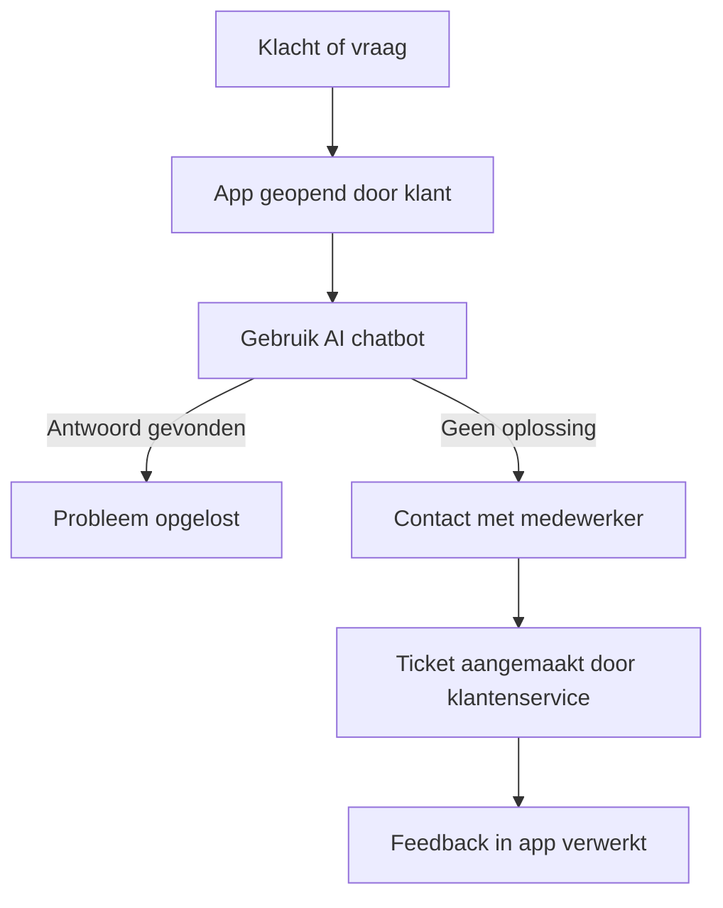

## Bedrijfsprocesanalyse – SolMate

### Inleiding

SolMate wil een mobiele applicatie ontwikkelen om de klanttevredenheid te verhogen, de werkdruk op de klantenservice te verminderen en de communicatie tussen klant en bedrijf te verbeteren. Momenteel verloopt klantcontact voornamelijk via traditionele kanalen zoals e-mail en telefoon. In deze analyse onderzoeken we het bestaande proces (IST), het gewenste proces (SOLL), de knelpunten (GAP) en gebruiken we een SIPOC-model om het klantondersteuningsproces te visualiseren.

---

### IST (Huidige situatie)

**Beschrijving:** Klanten nemen contact op met de klantenservice via telefoon of e-mail voor vragen, klachten of technische problemen.

**Problemen:**

* Lange wachttijden bij klantenservice.
* Weinig inzicht in klantendata en veel handmatig werk.
* Hoge personeelskosten.
* Gebrek aan 24/7 ondersteuning.

---

### SOLL (Gewenste situatie)

**Beschrijving:** Klanten gebruiken de mobiele app om direct antwoord te krijgen via een AI-chatbot, toegang te krijgen tot handleidingen, de status van hun producten te controleren, productupdates te lezen, en indien nodig contact op te nemen met een medewerker.

**Verbetermogelijkheden:**

* 24/7 service via AI-chatbot.
* Klanten kunnen veelvoorkomende problemen zelfstandig oplossen.
* Minder druk op klantenservice.
* Meer klantinzicht via app-data.

---

### GAP Analyse
In het onderstaande overzicht analyseren we de kloof (GAP) tussen de huidige situatie (IST) en de gewenste situatie (SOLL). We tonen welke knelpunten er zijn en welke concrete oplossingen de app van SolMate hiervoor biedt. Deze analyse helpt bij het bepalen waar de grootste winst te behalen valt met het nieuwe systeem

| Huidige Knelpunten                        | Oplossing via App                                                       |
| ----------------------------------------- | ----------------------------------------------------------------------- |
| Geen centrale plek voor productinformatie | App centraliseert alle klantinformatie en updates over producten        |
| Lange wachttijden bij klantenservice      | AI chatbot beantwoordt veel vragen automatisch                          |
| Hoge werkdruk op medewerkers              | Self service via app verlaagt de noodzaak voor direct menselijk contact |
| Weinig inzicht in klantbehoeften          | App verzamelt data over klantinteracties                                |

---

### SIPOC-Model – Klantondersteuning via de App

Om beter inzicht te krijgen in het klantondersteuningsproces, gebruiken we het SIPOC-model. Dit model toont de belangrijkste onderdelen van het proces van klacht tot oplossing, en laat zien wie betrokken zijn bij elke stap.

---

### Visualisatie
De onderstaande visualisatie biedt een schematisch overzicht van het huidige (IST) en gewenste (SOLL) klantondersteuningsproces. Deze tekening maakt in een oogopslag duidelijk waar knelpunten zitten, en hoe het nieuwe systeem deze gaat aanpakken. Dit helpt stakeholders en ontwikkelaars om de impact van de verandering te begrijpen.

---

### Conclusie

Het huidige klantondersteuningsproces is inefficiënt en kostbaar. Door het proces te digitaliseren via een mobiele app, verhoogt SolMate niet alleen de klanttevredenheid, maar verlaagt het ook structureel de kosten. De SIPOC-analyse en GAP-analyse bieden handvatten om dit procesdoelgericht in te richten.

