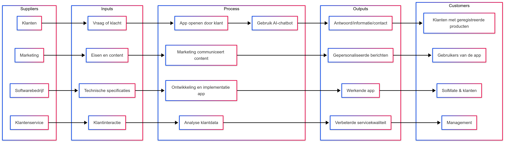

## Bedrijfsprocesanalyse – SolMate

### Inleiding

SolMate ontwikkelt een mobiele app om de klanttevredenheid te verhogen, de werkdruk op de klantenservice te verminderen en de communicatie tussen klant en bedrijf te verbeteren. In deze analyse beschrijven we de belangrijkste bedrijfsprocessen, het huidige proces (IST), het gewenste proces (SOLL), de knelpunten (GAP) en gebruiken we een SIPOC-model voor het klantondersteuningsproces.

---

### Overzicht van de hoofdprocessen binnen SolMate

1. **Productontwikkeling**  
   Ontwikkelen en verbeteren van de SolMate-smartphones en de mobiele app.

2. **Productie en logistiek**  
   Fabricage van smartphones en distributie naar winkels en klanten.

3. **Marketing en verkoop**  
   Promotie van de producten en app, en verkoop via verschillende kanalen.

4. **Klantenservice en support**  
   Ondersteuning van klanten via telefoon, e-mail en de app.

5. **After-sales service**  
   Garantie, reparatie en feedbackverwerking via de app.

---

### IST (Huidige situatie)

**Beschrijving:**  
Momenteel verloopt klantcontact voornamelijk via traditionele kanalen zoals e-mail en telefoon. Andere processen, zoals productie en marketing, zijn losstaand en weinig geïntegreerd met klantdata.

**Problemen:**

- Lange wachttijden bij klantenservice.
- Weinig inzicht in klantendata en veel handmatig werk.
- Hoge personeelskosten voor support.
- Geen centrale digitale plek voor klanten om informatie te vinden.
- Productontwikkeling krijgt weinig directe feedback van gebruikers.

---

### SOLL (Gewenste situatie)

**Beschrijving:**  
De mobiele app biedt een centrale plek waar klanten support krijgen via een AI chatbot, handleidingen raadplegen, productstatus controleren en updates ontvangen. De app integreert klantdata om marketing, productontwikkeling en service te verbeteren.

**Verbetermogelijkheden:**

- 24/7 service via AI chatbot.
- Klanten lossen veelvoorkomende problemen zelf op via de app.
- Minder werkdruk bij klantenservice.
- Directe feedbackloop van klanten naar productontwikkeling.
- Marketing kan gepersonaliseerde promoties sturen op basis van app-data.
- Beter inzicht in klantbehoeften voor alle afdelingen.

---

### GAP Analyse

Hieronder de belangrijkste knelpunten (GAP) tussen IST en SOLL en oplossingen die de app biedt:

```mermaid
graph TD
    A[Geen centrale plek voor productinformatie] --> A1[App centraliseert alle klantinformatie en updates]
    B[Lange wachttijden bij klantenservice] --> B1[AI chatbot beantwoordt veel vragen automatisch]
    C[Hoge werkdruk op medewerkers] --> C1[Self service via app verlaagt noodzaak voor menselijk contact]
    D[Weinig inzicht in klantbehoeften] --> D1[App verzamelt data over klantinteracties]
    E[Gebrek aan klantfeedback in productontwikkeling] --> E1[Feedback via app wordt doorgegeven aan productteam]
    F[Marketing heeft beperkte klantinformatie] --> F1[App-data ondersteunt gerichte promoties]

---

### SIPOC-Model – Klantondersteuning via de App

Om beter inzicht te krijgen in het klantondersteuningsproces, gebruiken we het SIPOC-model. Dit model toont de belangrijkste onderdelen van het proces van klacht tot oplossing, en laat zien wie betrokken zijn bij elke stap.




---

### Visualisatie
De onderstaande visualisatie biedt een schematisch overzicht van het huidige (IST) en gewenste (SOLL) klantondersteuningsproces. Deze tekening maakt in een oogopslag duidelijk waar knelpunten zitten, en hoe het nieuwe systeem deze gaat aanpakken. Dit helpt stakeholders en ontwikkelaars om de impact van de verandering te begrijpen.

```mermaid
graph TD
    A[Klacht of vraag] --> B[App geopend door klant]
    B --> C[Gebruik AI chatbot]
    C -->|Antwoord gevonden| D[Probleem opgelost]
    C -->|Geen oplossing| E[Contact met medewerker]
    E --> F[Ticket aangemaakt door klantenservice]
    F --> G[Feedback in app verwerkt]
```

---

### Conclusie

Het huidige klantondersteuningsproces is inefficiënt en kostbaar. Door het proces te digitaliseren via een mobiele app, verhoogt SolMate niet alleen de klanttevredenheid, maar verlaagt het ook structureel de kosten. De SIPOC-analyse en GAP-analyse bieden handvatten om dit procesdoelgericht in te richten.

