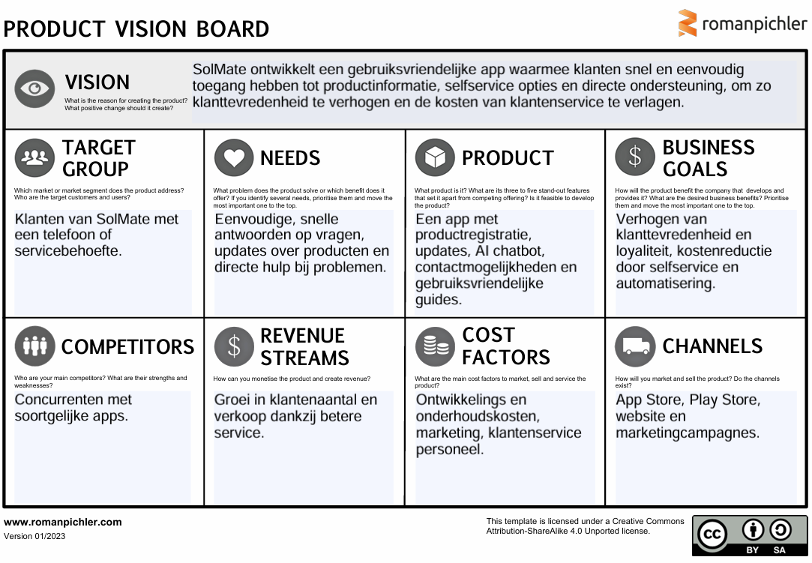

## Product Vision Board

In dit Product Vision Board brengen we helder in kaart voor wie ons product bedoeld is, welke behoeften deze gebruikers hebben, en hoe ons product hierop inspeelt. Daarnaast laten we zien welke zakelijke doelstellingen we met het product nastreven en hoe we ons positioneren ten opzichte van concurrenten. Ook benoemen we de inkomstenstromen, kostenfactoren en kanalen waarmee we het product onder de aandacht brengen.

Dit overzicht helpt ons om gericht te werken aan een product dat niet alleen waardevol is voor onze klanten, maar ook bijdraagt aan het succes van SolMate

