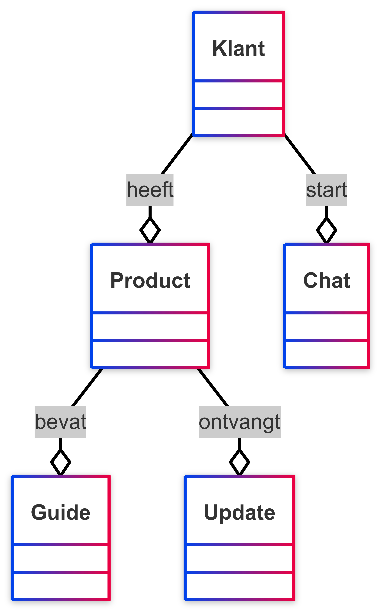

## Domeinmodel

Het domeinmodel laat zien welke belangrijke dingen (zoals klanten en producten) in ons systeem zitten, en hoe die dingen met elkaar te maken hebben. Het is een soort overzicht van hoe de SolMate-app werkt.

In ons model zie je bijvoorbeeld dat een klant één of meer producten kan hebben. Elk product kan updates krijgen en heeft een handleiding (guide). Klanten kunnen ook via een chat praten met een chatbot of medewerker. Dit model helpt ons om te snappen wat er allemaal in het systeem moet gebeuren.

## UML Klassendiagram

Het UML-klassendiagram laat in meer detail zien hoe het systeem eruitziet. Het toont per onderdeel (bijvoorbeeld "Klant" of "Product") welke informatie erin zit (zoals naam, e-mailadres of serienummer) en hoe alles met elkaar verbonden is.

Dit diagram is handig voor de mensen die de app bouwen, zodat ze weten hoe alles technisch moet worden geregeld. Zo zie je bijvoorbeeld dat één klant meerdere producten kan hebben, of dat elk chatbericht bij een klant hoort.

