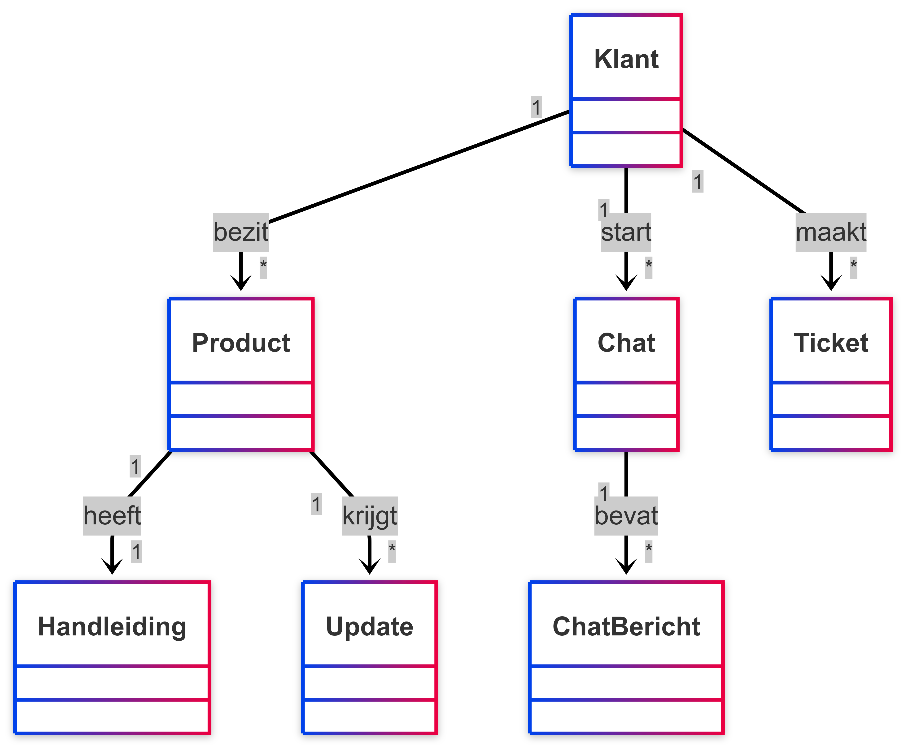
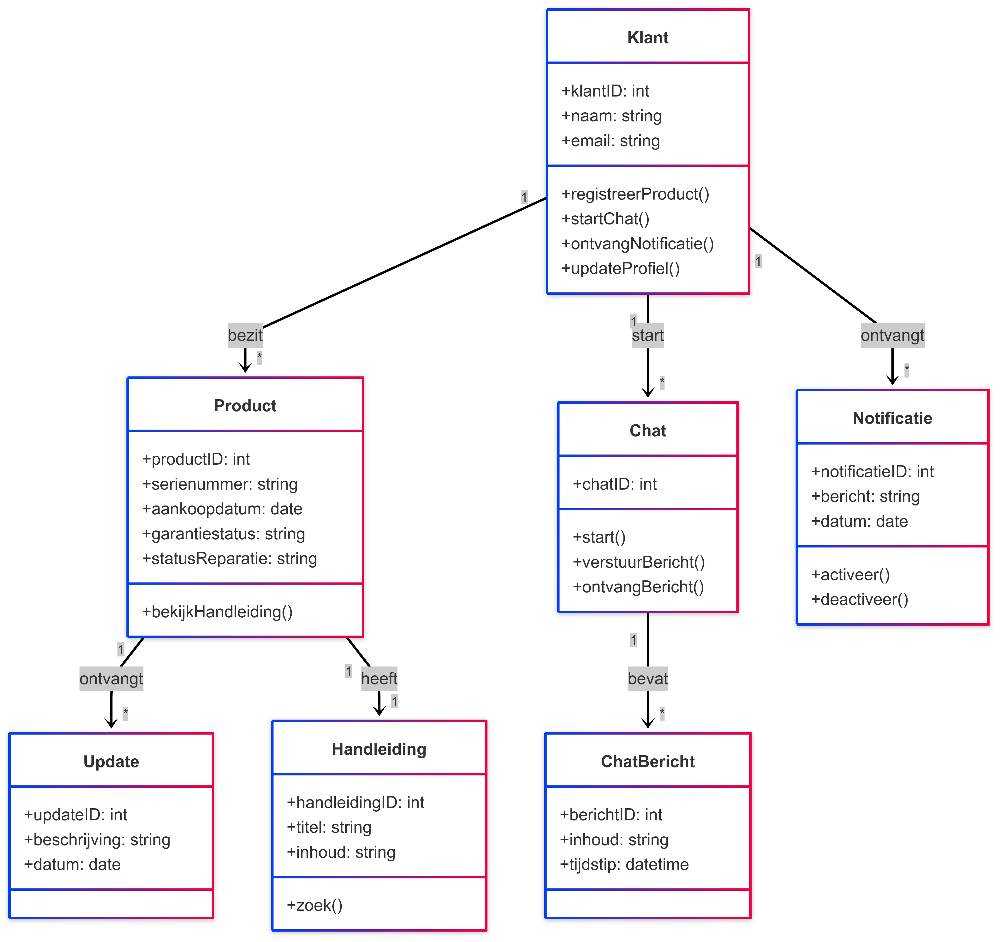

## Domeinmodel

Het domeinmodel geeft een overzicht van de belangrijkste onderdelen binnen het SolMate-systeem en hoe deze met elkaar verbonden zijn.

In het model zie je dat een klant één of meerdere producten kan bezitten. Elk product heeft een handleiding en kan meerdere updates ontvangen. Klanten kunnen via een chat communiceren, waarbij elke chat uit meerdere chatberichten bestaat. Daarnaast kunnen klanten ook tickets aanmaken voor extra ondersteuning.
Dit model helpt om inzicht te krijgen in welke onderdelen het systeem moet bevatten en hoe deze samenwerken om de functionaliteiten in de app te ondersteunen.

## UML Klassendiagram

Het UML-klassendiagram laat in meer detail zien hoe het systeem eruitziet. Het toont per onderdeel (bijvoorbeeld "Klant" of "Product") welke informatie erin zit (zoals naam, e-mailadres of serienummer) en hoe alles met elkaar verbonden is.

Dit diagram is handig voor de mensen die de app bouwen, zodat ze weten hoe alles technisch moet worden geregeld. Zo zie je bijvoorbeeld dat één klant meerdere producten kan hebben, of dat elk chatbericht bij een klant hoort.

