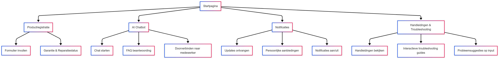

# Sitemap van de SolMate App

Hieronder zie je de sitemap van de SolMate app. Deze sitemap geeft een overzicht van de belangrijkste schermen en functies binnen de app, zodat duidelijk wordt hoe de gebruiker door de app kan navigeren. Elke hoofdpagina heeft logische onderverdelingen om de ervaring overzichtelijk, gebruiksvriendelijk en efficiënt te maken.

## Uitleg van de onderdelen

### Startpagina  
Het beginscherm van de app waar de gebruiker toegang heeft tot alle functies.

### Productinformatie  
Hier vindt de klant alle details over het geregistreerde product, zoals serienummer, specificaties en garantie.

### AI Chatbot  
Een slimme assistent die veelgestelde vragen automatisch beantwoordt.

- **Veelgestelde Vragen**: Lijst met standaardvragen en -antwoorden.  
- **Stel een Vraag**: Klant kan zelf een vraag intypen en antwoord ontvangen via AI.

### Handleiding  
Digitale gebruiksaanwijzing voor het product, met tips en uitleg.

### Updates  
Informatie over software-updates, nieuwe functies of verbeteringen voor het product.

### Klantenservice  
Als de chatbot geen oplossing biedt, kan de klant hier verdere hulp krijgen.

- **Ticket Aanmaken**: Klant dient een verzoek in voor hulp.  
- **Live Chat / E-mail**: Alternatieve manieren om contact op te nemen met SolMate.

### Profielpagina  
Persoonlijke gegevens van de klant.

- **Instellingen**: Taal, meldingen, wachtwoord wijzigen.  
- **Product Registreren**: Klant voegt een nieuw SolMate product toe aan zijn profiel.

