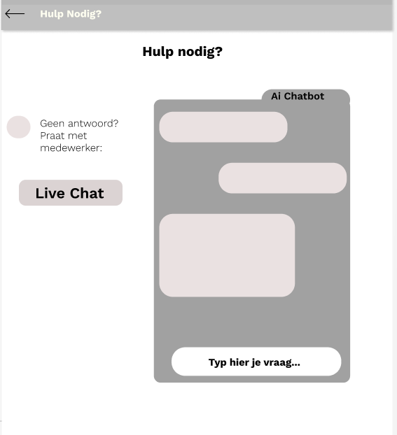

### Toelichting bij Wireframe 1: Productregistratie

Op dit scherm kunnen klanten makkelijk hun producten registreren.  
Ze vullen alleen het serienummer en de aankoopdatum in.
Als de registratie gelukt is, krijgen ze een bericht dat hun product is toegevoegd aan hun account.  
Daarna kunnen ze in de app altijd zien hoe het staat met hun garantie en eventuele reparaties.  

___
### Wireframe 2: AI Chatbot voor FAQ

Deze pagina laat zien hoe klanten snel antwoord kunnen krijgen op hun vragen via de AI-chatbot. 

- Klanten kunnen direct een chat starten met de bot.
- De chatbot helpt met veelgestelde vragen, zodat klanten niet altijd een medewerker nodig hebben.
- Als de chatbot het antwoord niet weet, kunnen klanten makkelijk doorgestuurd worden naar een medewerker voor extra hulp.

Dit zorgt voor snelle en makkelijke klantenservice, zonder lange wachttijden.

___
