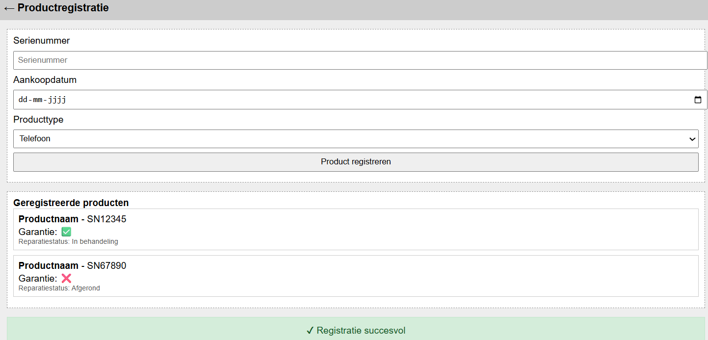
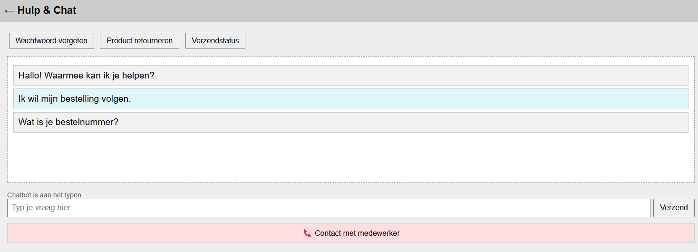
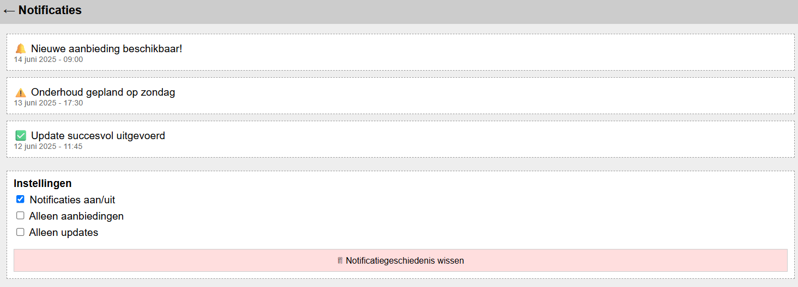
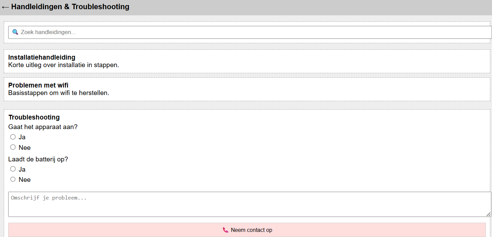

# Wireframes & Beschrijvingen

### Wireframe 1: Productregistratie

**Doel:**  
Deze pagina laat gebruikers toe om hun product te registreren met een serienummer, aankoopdatum en producttype.

**Opbouw:**  
- Bovenaan: Titel en terugknop.  
- Midden: Een eenvoudig formulier met drie velden en een knop “Product registreren”.  
- Onder het formulier: Een lijst met eerder geregistreerde producten, met info over garantie en reparatiestatus.  
- Helemaal onderaan: Een meldingsvak voor feedback na registratie (bijv. succesvol of foutmelding).
  

___
### Wireframe 2: AI Chatbot

**Doel:**  
Een ondersteunende chatinterface waar de gebruiker vragen kan stellen aan een chatbot, met de mogelijkheid om over te schakelen naar een medewerker.

**Opbouw:**  
- Bovenaan: Titel en terugknop.  
- Onder de header: Knoppen met veelgestelde vragen (FAQ).  
- Chatvenster: Toon berichten van gebruiker en chatbot in simpele tekstballonnen.    
- Onderaan: Invoerveld met verzendknop en een knop “Contact met medewerker” voor extra hulp.  

___
### Wireframe 3: Notificaties

**Doel:**  
Gebruikers informeren over updates, waarschuwingen en aanbiedingen via een lijst van meldingen.

**Opbouw:**  
- Bovenaan: Titel en terugknop.  
- Midden: Scrollbare lijst met notificaties, elk met een titel, korte omschrijving, icoon en datum/tijd.  
- Onderaan: Instellingenblok waar gebruikers voorkeuren kunnen kiezen (zoals soort meldingen) en notificaties kunnen wissen. 

___

## 4. Handleidingen & Troubleshooting
**Doel:**  
Helpen bij het vinden van handleidingen of het oplossen van technische problemen via stapsgewijze vragen.

**Opbouw:**  
- Bovenaan: Titel, terugknop en zoekbalk om handleidingen te vinden.  
- Onder de zoekbalk: Lijst van handleidingen als klikbare blokken.  
- Onderaan: Troubleshootinggedeelte met simpele ja/nee-vragen en een tekstvak voor probleemomschrijving.  
- Eindigt met een knop “Neem contact op” als het probleem niet is opgelost.  

