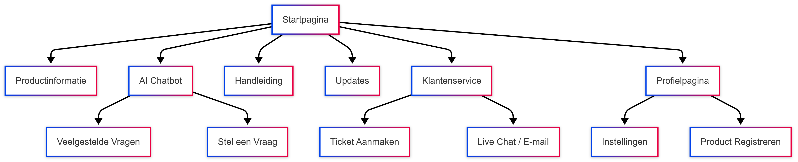

# _Requirements-specificatie_
Welkom bij de requirements specificatie van SolMate, ons innovatieve telefoonbedrijf gespecialiseerd in het ontwikkelen van mobiele telefoons met geintegreerde zonnepaneeltechnologie.

SolMate speelt in op de hedendaagdse ehoefte aan duurzaamheid, zelfredzaamheid en onafhankelijkheid van het stroomnetwerk. In deze bestanden wordt beschreven hoe en waarom maatwerksystemen passend zijn voor SolMate.

Het document dient als leidraad voor zowel de stakeholders als het developmentteam en zorgt voor het omzetten van de behoeften van de organisatie naar concrete modeelen en user stories. 

## Organisatorische Context

### _Missie_
Wij van SolMate willen mensen wereldwijd de vrijheid bieden om altijd en overal bereikbaar te zijn zonder afhankelijk te zijn van elektrische voorzieningen. 
Wij zijn gefocused op de ontwikkeling van duurzame telefoons met geintegreerde zonnepaneel techniek. Dit om de duurzaamheid te bevorderen en de ervaring van de klant te vergemakkelijken.

### _Visie_
Wij streven naar een toekomst waarbij technologie en duurzaamheid hand in hand gaan. Ook werken wij toe naar een positie als marktleider in solar-powered mobiele aparaten om zo een positieve impact af te kunnen dragen op het millieu en het leven van de eindgebruikers

### _Strategie_
Om zowel de missie als de visie van SolMate te kunnen realiseren richten wij ons op een aantal belangerijke kernpunten: 
- Duurzaam productontwerp: Door het gebruik van millieuvriendelijke en effiente  materialen leveren wij onze producten met een minimale voetafdruk.
- Innovatie: Door contunue onderzoek en doorontwikkeling om de nieuwste trends in solar tech bij te houden en bij succes te implementeren.
- Gebruiksvriendelijkheid: Een eenvoudige gebruiksvriendelijkheid van de online omgevingen, vanaf de productpagina tot een helpdesk voor problemen is geregeld door een proffesionele AI chatbot, die waar nodig escaleert naar een mederwerker. 
Gerichte doelgroep: Wij zijnn gericht op een bepaalde groep die extra baat zullen hebben bij onze diensten. Denk hierbij aan reizigers, outdoor liefhebbers en mensen in buitengebieden met beperkte toegang tot electriciteit. 
### _Stakeholderanalyse_

Om een maatwerksysteem voor SolMate goed op te kunnen ontwikkelen is het cruciaal om duidelijk in kaart te hbeben welke partijen nou eigenlijk allemaal belangen hebben bij dit project. In deze stakeholderanalyse gaan we alle relevante stakeholders van SolMate identificeren en analyseren. We kijken hierbij naar hun rol, belangen en de invloed die zij hebben op het project. 

Eerst geven we even een korte beschrijving van de verschillende stakeholders:
- Eindgebruiker: De meest belangrijke stakeholder van SolMate is natuurlijk de klant, oftewel de eindgebruiker. Zij hebben het grootste directe belang bij het gebruiksgemak, duurzaamheid en de betrouwbaarheid van de producten. Ook is feedback van deze groep enorm waardevol voor de doorontwikkelingen van de producten. 
- Ontwikkelaars: De ontwikkelaars zijn verantwoordelijk voor het daadwerkelijk realiseren van het systeem. Voor hen is het belangrijk om duidelijke eisen te hebben om zo de technische haalbaarheid in te schatten.
- Product Owner: De procut woner bewaakt de visie van SolMate en vertaald de verschillende wensen van de stakeholders naar realistische user stories.
- Marketing: Het marketingteam heeft ook belang bij heldere USP's en toegang tot klantinzichten om zo SolMate het best te kunnen promoten. 

| Stakeholder              | Belang                                                   | Invloed  | Verwachting / Opmerking                                     |
|--------------------------|----------------------------------------------------------|----------|-------------------------------------------------------------|
| **Raad van Commissarissen**  |  klantloyaliteit, besparing op klantenservice                                     | Hoog     | Verwacht strategisch rendement en rapportage               |
| **CEO / Management**        | Succesvolle implementatie, tevreden klanten, winstgevendheid | Hoog     | Behoefte aan strategische beslissingen en transparantie     |
| **Marketing**               | Meer klantbetrokkenheid, klantendata                 | Middel   | Verwacht analysefuncties en promotiemogelijkheden           |
| **Klantenservice**          | Minder druk door self-service      | Laag     | Verwacht heldere structuur voor klanten                     |        |
| **Klanten (eindgebruikers)**| Gebruiksvriendelijke app,  toegevoegde waarde    | Middel   | Verwacht gemak, duidelijkheid, veiligheid                   |
| **Externe softwarebedrijf** | Duidelijke specificaties, betaalde opdracht              | Hoog     | Verwacht concrete eisen en feedback                        |

### _Actoren_

#### 1. **Klanten (Eindgebruikers)**
- **Beschrijving**: Personen die de app gebruiken voor het registreren van producten, het aanvragen van garantieclaims, het volgen van reparaties, en het ontvangen van gepersonaliseerde aanbiedingen en notificaties.
- **Rol**: Eindgebruiker
- **Behoeften**:
  - Gebruiksvriendelijke interface.
  - Eenvoudige toegang tot productinformatie, handleidingen, en updates.

#### 2. **Externe Softwarebedrijf**
- **Beschrijving**: Het softwarebedrijf dat verantwoordelijk is voor de technische ontwikkeling van de mobiele applicatie.
- **Rol**: Ontwikkelaar 
- **Behoeften**:
  - Duidelijke specificaties en eisen.
  - Goede communicatie en feedback voor het ontwikkelen van de app.

#### 3. **Raad van Commissarissen**
- **Beschrijving**: De raad die goedkeuring geeft voor de ontwikkeling van de app.
- **Rol**: beslisser
- **Behoeften**:
  - Zekerheid dat de app bijdraagt aan klanttevredenheid en verhoogde klantloyaliteit.
  - Winstgevendheid en bedrijfsgroei door de app.

#### 4. **CEO / Management**
- **Beschrijving**: Het managementteam van PhoneVentures dat verantwoordelijk is voor de uitvoering van de strategische visie van de organisatie.
- **Rol**: Leiderschap
- **Behoeften**:
  - uitvoering van het project.

#### 5. **Marketing**
- **Beschrijving**: Het marketingteam dat de promotie van de app verzorgt.
- **Rol**: Promotie en desing app
- **Behoeften**:
  - Inzichten in klantgedrag.
  - Goed contact met extern software bedrijf.

#### 6. Klantenservice
- **Beschrijving**: Het klantenserviceteam dat ondersteuning biedt aan de klanten van Solmate.
- **Rol**: Ondersteuning
- **Behoeften**:
  - Vermindering werkdruk door self-service mogelijkheden via de app.
  - Eenvoudige toegang tot klantgegevens voor ondersteuning klantproblemen.

### _Bedrijfsprocesanalyse_

#### IST
- Beschrijving: Klanten kunnen contact opnemen met klantenservice indien er problemen, vragen of klachten zijn.
- Problemen:
  - Lange wachttijden voor klantservice.
  - Weinig inzicht op klantendata.
  - Veel tijd en geld kwijt wegens personeel

#### SOLL
- Beschrijving: De app biedt klanten de mogelijkheid om 24/7 gebruik te maken van een AI-chatbot voor het beantwoorden van veelgestelde vragen en het geven van technische ondersteuning, daarnaast hebben de klanten de mogelijkheid om guides te bekijken, status van hun producten te zien, nieuws over de producten te lezen of contact op te nemen met een medewerker.
- Verbetermogelijkheden:
  - Verminderen van wachttijden voor klantenservice.
  - Beter inzicht in klanttevredenheid door digitale feedback.

#### GAP

- **Huidige Gap**: Er is geen centrale plaats op mobiel voor klanten om informatie te krijgen over onze producten.
- **Oplossing**: De app bied klanten meerdere mogelijkheden aan om meer te leren overons product en krijgen nieuws binnen over updates etc.

- **Huidige Gap**: Er is onvoldoende self-service voor klanten, wat leidt tot lange wachttijden bij klantenservice en een hoge werkdruk op medewerkers en meer kosten aan klantenservice.
- **Oplossing**: De app biedt pties zoals een AI-chatbot en de mogelijkheid om veelvoorkomende problemen zelf op te lossen voordat een medewerker moet worden gecontacteerd wat geld en tijd bespaard.

#### SIPOC Model

| **S (Suppliers)**                 | **I (Inputs)**                             | **P (Process)**                                                                 | **O (Outputs)**                                 | **C (Customers)**                                          |
|-----------------------------------|-------------------------------------------|-------------------------------------------------------------------------------|-------------------------------------------------|------------------------------------------------------------|
| Klanten                           | Klacht of vraag                           | Klant opent app > stelt vraag in de app                                       | Tevredenheid                                    | Klanten die toegang hebben tot hun geregistreerde producten en relevante updates. |
| Marketing                         | Eisen voor app                            | Marketing maakt lijst van eisen en stuurt deze naar het externe softwarebedrijf | App                                              | Klanten die hun producten kunnen registreren via de app |
| Extern softwarebedrijf           | Data voor app                             | Extern softwarebedrijf ontwikkelt app en geeft deze aan het bedrijf            | Automatische meldingen van garantie             | Klanten die updates ontvangen over hun geregistreerde producten |
| Klantenservice                    | Response klant                            | Klantenservice opent ticket voor klant en beantwoordt dit                      | Klanttevredenheid                               | Klanten die hulp ontvangen bij hun vragen of problemen via de app |

#### Product Vision Board 

| **TARGET GROUPS**                                                                | **NEEDS**                                                                                         | **PRODUCT**                                                                                                         | **BUSINESS GOALS**                                                                                               |
|----------------------------------------------------------------------------------|---------------------------------------------------------------------------------------------------|---------------------------------------------------------------------------------------------------------------------|------------------------------------------------------------------------------------------------------------------|
| Klanten die een Telefoon hebben gekocht van Solmate                     | Klanten willen een eenvoudige manier om hun vragen beantwoord te krijgen en updates ontvangen. | app waarmee klanten updates ontvangen en selfservice hebben. | Verbeterde klantloyaliteit door verbeterde klantervaring en kostenbesparing door automatisering van de klantenservice. |
| Klanten die behoefte hebben aan klantenservice. | Klanten willen snel hulp bij hun klacht, vraag of probleem                  | Een chatbot in de app, mogelijkhijd om contact op te nemen, en een Guide over de telefoon.            | Verhogen van klanttevredenheid en vermindering van de kosten aan klantenservice. |

| **COMPETITORS**                                                   | **REVENUE STREAMS**                                                   | **COST FACTORS**                                                                                       | **CHANNELS**                                                                                                  |
|-------------------------------------------------------------------|----------------------------------------------------------------------|--------------------------------------------------------------------------------------------------------|----------------------------------------------------------------------------------------------------------------|
| - Concurrenten die ook een app hebben | - meer mensen die interesse hebben in een Solmate product door goede klantrelaties | - Ontwikkelingskosten voor de app, marketing- en verkoopkosten, kosten van klantenservice personeel.   | - App Store en Play Store.|

#### User Stories

**Als** klant  
**wil ik** meldingen ontvangen over updates  
**zodat** ik als eerste de nieuwe functies heb.

##### Acceptatiecriteria
- updates voor de solmate telefoon
- Update pushberichten op het app

**Als** klant  
**wil ik** toegang tot duidelijke guides binnen handberijk over de solmate telefoon
**zodat** ik mijn apparaat optimaal kan gebruiken.

##### Acceptatiecriteria
- Handleidingen zijn per product beschikbaar.
- Zoekfunctie in de app.

**Als** klant  
**wil ik** een hatbot kunnen gebruiken voor mijn vragen  
**zodat** ik niet met een echt persoon hoef te praten want ik ben verlegen

##### Acceptatiecriteria
- Chatbot is 24/7 beschikbaar.
- Antwoorden op veelgestelde vragen zijn correct en duidelijk.

**Als** Klantenservice  
**wil ik** een lagere werkdruk
**zodat** ik meer tijd heb om goed advies te geven per klant

##### Acceptatiecriteria
- kortere wachtijden
- minder klanten per dag

##### Dor 

- **Marketingteam heeft het plan goedgekeurd:** Het marketingteam heeft duidelijke plannen en voorwaarden opgesteld voor de appontwikkeling.
- **Contactgegevens klantenservice beschikbaar:** Klanten kunnen eenvoudig de contactgegevens van de klantenservice vinden binnen de app.
- **Goedkeuring Raad van Commissarissen:** Het ontwikkelingsplan is goedgekeurd door de Raad van Commissarissen.

##### Dod

- **Volledige functionaliteit geleverd:** De app is geleverd en alle vereiste functionaliteiten werken zoals gevraagd in de specificaties.
- **App live in de app stores:** De app is succesvol gelanceerd en is beschikbaar in de App Store en Play Store.
- **App gedownload door klanten:** Klanten hebben de app gedownload en gebruiken deze actief.
- **Positieve appbeoordelingen:** De app heeft positieve beoordelingen in de app stores.
- **Verlaagde werkdruk voor klantenservice:** Door de app is de werkdruk bij de klantenservice significant verlaagd.

#### UMLKlassendiagram

| **Klasse**     | **Belangrijke Attributen**                                | **Relaties**                                    |
|----------------|------------------------------------------------------------|--------------------------------------------------|
| **Klant**      | klantID, naam, email                                       | Heeft meerdere producten                        |
| **Product**    | productID, naam, serienummer, aankoopDatum                 | Hoort bij één klant, heeft garantie & updates   |
| **GUide**   | Guide versie                                      | Hoort bij één product                           |
| **Update**     | versie, beschrijving                             | Hoort bij één product                           |
| **Chat**       | inhoud, chatID                             | Hoort bij één klant                             |

#### Sitemap 

Bronen; https://canvas.hu.nl/courses/44699
https://www.perforce.com/blog/alm/how-write-software-requirements-specification-srs-document
Versietabel; gecomit en teamoverlg erover.

Team;  SolMate 

